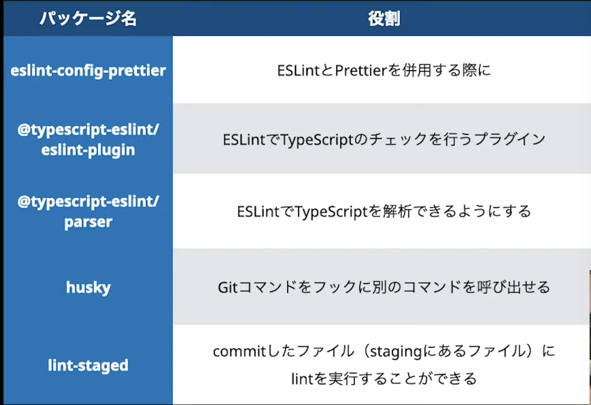

# next.jsの環境構築

- プロジェクトの作成
> 作業用ディレクトリに移動し、以下のコマンドを実行し、プロジェクトを作成  
> 以下はトラハックさんが使ってるコマンド  
`npx create-next-app nextjs-blog --use-npm --example "https://github.com/vercel/next-learn-starter/tree/master/dynamic-routes-starter"`

> 以下はドキュメントに記載のコマンドでプロジェクト作成(なぜかeslintが入ってない)  
`npx create-next-app nextjs-blog --use-npm --example "https://github.com/vercel/next-learn-starter/tree/master/learn-starter"`

> 以下はyarnコマンドでのプロジェクト作成   
`yarn create next-app --typescript`

- TypeScript環境構築
> 作業用プロジェクトで、以下のコマンドを実行でパッケージをインストール  
`npm install --save-dev typescript ts-loader webpack webpack-cli webpack-dev-server`

- ESLintとPrettierのCI環境を構築
> 作業用プロジェクトで、以下のコマンドを実行でパッケージをインストール  
`npm install --save-dev eslint eslint-config-prettier prettier @typescript-eslint/parser @typescript-eslint/eslint-plugin husky lint-staged`

- パッケージ内容


- prettierの設定
> ルートディレクトリ下に`.prettierrc`ファイルを作成する  
> `.prettierrc`の内容に以下を記入する  
```json
{
  "printWidth": 120, //自動で改行してくれる文字数
  "singleQuote": true, //シングルクォートを使用する
  "semi": false, //セミコロンを自動で入れる
}
```

- ESLintの設定
> ルートディレクトリ下に`.eslintrc.js`ファイルを作成する  
> `.eslintrc.js`の内容に以下を記入する  
```js
module.exports = {
  env: {
    browser: true,
    es6: true
  },
  extends: [
    "eslint:recommended",
    "plugin:@typescript-eslint/recommended", // TypeScriptでチェックされる項目をLintから除外する設定
    "prettier", // prettierのextendsは他のextendsより後に記述する
    "prettier/@typescript-eslint",
  ],
  plugins: ["@typescript-eslint"],
  parser: "@typescript-eslint/parser",
  parserOptions: {
    "sourceType": "module",
    "project": "./tsconfig.json" // TypeScriptのLint時に参照するconfigファイルを指定
  },
  root: true, // 上位ディレクトリにある他のeslintrcを参照しないようにする
  rules: {}
}
```

- package.jsonに`"Lint-fix": "eslint --fix './src/**/*.{js.ts}' "`を追加する
```js
  "scripts": {
    "dev": "next dev",
    "build": "next build",
    "start": "next start",
    "Lint-fix": "eslint --fix './src/**/*.{js.ts}' " //⇦追加する
  },
```